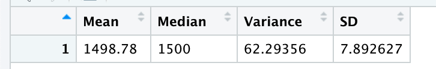

# MechaCar Prototype Statistical Analysis
The goal of this project is to perform various statistical tests on MechaCar prototype data sets in order to identify any potential issues within the data sets, as well as determine future analysis needs

## Linear Regression to Predict MPG
An analysis was performed on miles per gallon data to understand what variables most impact performance.  

Based on the R-squared value, 71% of the variability in MPG can be explained by this model.  Additionally, ground clearance and vehicle length have the most significant level of impact in determining MPG performance.  The slope of the linear model is non-zero, since there are multiple coefficients that have a non-zero value (beyond ground clearance and vehicle length, AWD also has a high coefficient, but a lower level of significance).  This model can be used to predict MPG of MechCar prototypes, since the p-value is lower than 0.05, and we can reject the null hypothesis.

## Summary Statistics on Supspension Coils
To ensure safe operation of the vehicles, an analysis was performed to analyze the PSI variance of the suspension coils.  An analysis was undertaken on the PSI values in total, as well as broken out by manufacturing lot.

In total, the variance of the suspension coils did not exceed 100 (it came in at 62), which was the allowable tolerance to ensure safety.  However, this does not hold true when looking at separate manufacturing lots.

As shown in the above screen shot, Lot3 does not fall within the safety tolerance of variance below 100 PSI (it shows a vrariance of 170).  Given these results, Lot3 suspension coils need to be rejected and any vehicles with those parts needs to be recalled.  

## T-Tests on Suspension Coils
A t-test was performed on the total summary for suspension coils, as well as each individual lot to confirm if there was a statistically significant difference between the means of each sample vs. the population mean PSI.  

The total summary shows a p-value equal to 1, which means there is not enough evidence to reject the null hypothesis based on this data set.  However, looking at each individual manufacturing lot provides a different perspective.
### Lot 1 Results

### Lot 2 Results

### Lot 3 Results

In each of the lot's t-test results, the p-value is below 0.05, so there is enough evidence to reject the null hypothesis.  Additionally, this reinforces the decision to reject lot 3 suspension coils due to safety risks.  

## Study Design: MechaCar vs Competition
In order to analyze, how MechaCar would perform vs. its competition, there are a few metrics that could be analyzed statistically to better understand impact to the consumer's purchase decision:
* Vehicle Price
* J.D. Power Ranking
* Highway MPG
* Reliability Rating

These are just a few variables that could potentially impact a buyer's decision to purchase a certain vehicle.  To reflect the purchase decision, you can use Unit Sales as the measure of impact In order to test these variables, you can analyze MechaCar's results vs. competition on each of these metrics.  We can take one of them as an example to demonstrate how a potential analysis could be conducted.

### Null and Alternative Hypothesis
Taking vehicle price as an example, the null and alternative hypothesis definitions could be structured as below:
* Null Hypothesis: Vehicle Price does not have an impact on Unit Sales
* Alternative Hypothesis: Vehicle Price does have an impact on Unit Sales

If we were looking at the impact across the above variables, I would perform a linear regression analysis across all of the variables and see what the coefficients would be (which would indicate a non-zero slope) as well as analyzing the p-value (targeting a value below 0.05) to ensure a high level of confidence in the results.  To run this comparison, I would need metrics on each of the above stated variables for MechCar vs. the competitive model(s), including sales units, which would be our dependent variable.  
