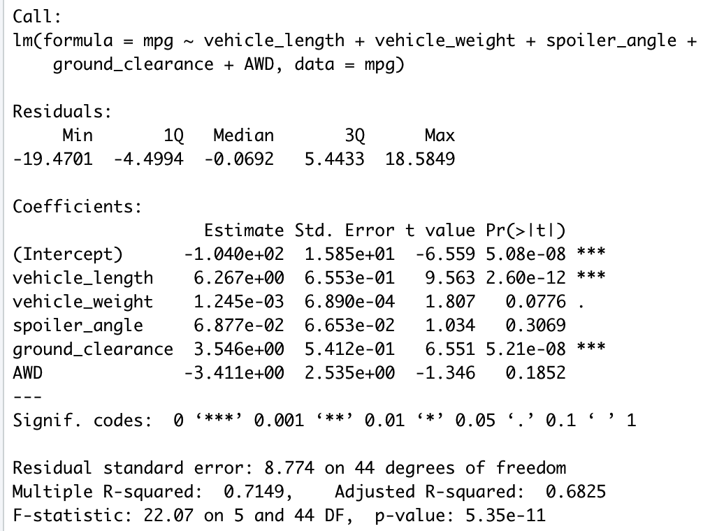

# MechaCar Prototype Statistical Analysis
The goal of this project is to perform various statistical tests on MechaCar prototype data sets in order to identify any potential issues within the data sets, as well as determine future analysis needs

## Linear Regression to Predict MPG
An analysis was performed on miles per gallon data to understand what variables most impact performance.  

